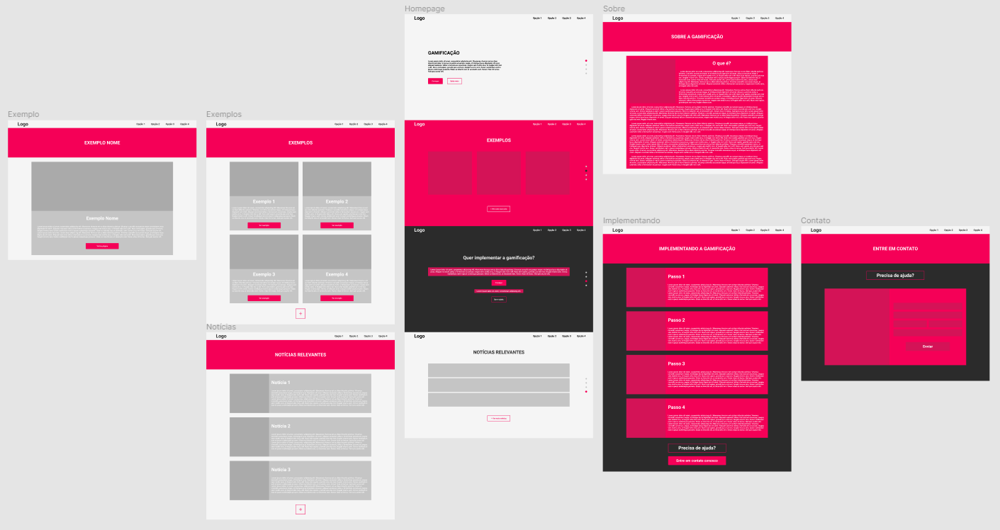

# Projeto de Interface

Para a criação da interface foi utilizado a plataforma <a href="https://figma.com/">Figma</a>, criando o User Flow de forma que a <a href="2-Especificação.md">Especificação do Projeto</a> fosse atendida. A partir daí o Wireframe do projeto foi construído, também no Figma, para permitir uma visualização simples do que é visualmente esperado desta plataforma.

- [Visualização no Figma](https://www.figma.com/file/TzEy9bNVufvSrhQx5FOjTQ/Gamifica%C3%A7%C3%A3o-na-Educa%C3%A7%C3%A3o?node-id=0%3A1)

## User Flow

> Fluxo de usuário (User Flow) é uma técnica que permite ao desenvolvedor
> mapear todo fluxo de telas do site ou app. Essa técnica funciona
> para alinhar os caminhos e as possíveis ações que o usuário pode
> fazer junto com os membros de sua equipe.

## Wireframes

> Para a visualização mais detalhada do Wireframe visite a página do projeto no Figma.
> - [Visualização no Figma](https://www.figma.com/file/TzEy9bNVufvSrhQx5FOjTQ/Gamifica%C3%A7%C3%A3o-na-Educa%C3%A7%C3%A3o?node-id=0%3A1)
> - [Protótipo interativo da página](https://www.figma.com/proto/TzEy9bNVufvSrhQx5FOjTQ/Gamifica%C3%A7%C3%A3o-na-Educa%C3%A7%C3%A3o?node-id=0%3A1&scaling=min-zoom&page-id=0%3A1&starting-point-node-id=13%3A3)

> Wireframes são protótipos usados em design de interface para sugerir a
> estrutura de um site web e seu relacionamentos entre suas
> páginas. Um wireframe web é uma ilustração semelhante do
> layout de elementos fundamentais na interface.