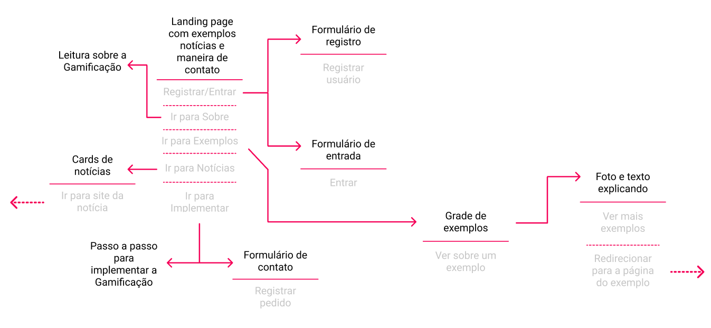

# Projeto da Solução

## Tecnologias Utilizadas

Linguagens de marcação, de estilização e programação:

- HTML
- CSS
- JavaScript

Bibliotecas e frameworks:

- jQuery (em estágios iniciais)
- Bootstrap

IDEs e editores de código:

- Visual Studio Code
- Replit

## Arquitetura da solução

A imagem a seguir representa o userflow do projeto.

- Ao entrar na página, o usuário terá algumas opções, registrar/entrar no
sistema, ir para a página "Sobre", ir para a página "Exemplos", ir para
a página "Notícias" ou ir para a página "Implementação".
- Na página "Sobre", encontra-se informações sobre a gamificação na
educação, para ter uma noção sobre o assunto.
- Na página "Exemplos", encontra-se cards de exemplos de páginas e
atividades que utilizam da gamificação na educação.
- Na página "Registrar/Entrar", o usuário é capaz de se conectar com o
sistema ao estar cadastrado no site.
- Na página "Notícias", encontra-se cards de notícias com as últimas
atualizações sobre a gamificação.
- Na página de "Implementação", encontra-se um passo a passo sobre com
implementar a gamificação aonde a pessoa preferir, com foco na
educação.

